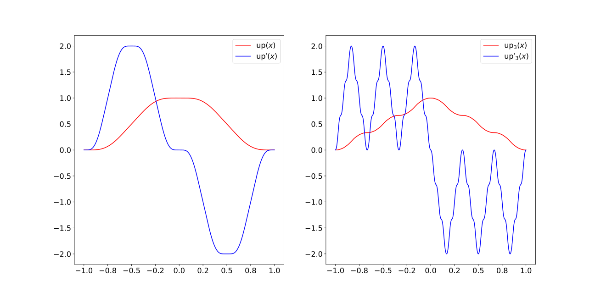
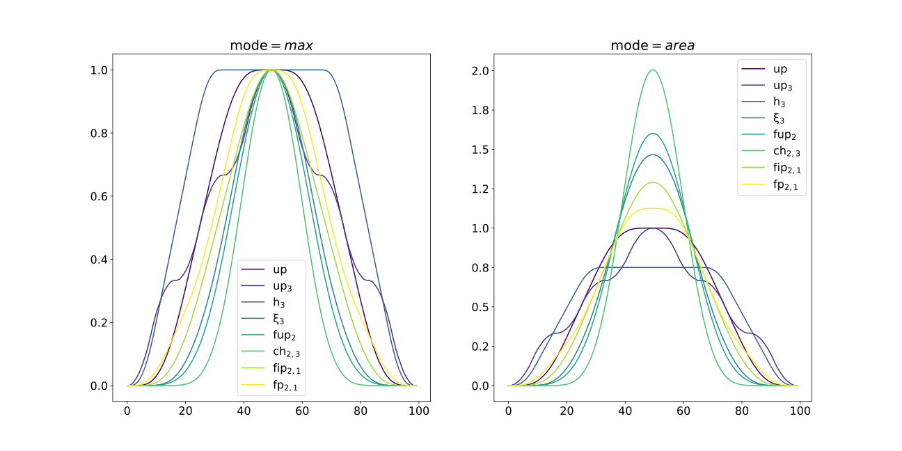
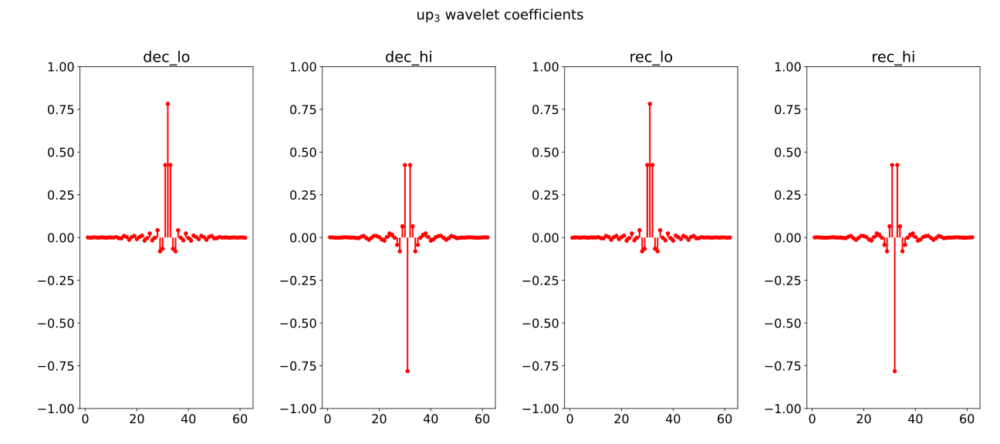

# waf by torch
## Version 1.0.0 
04.12.25

## Modules

### Kernel Functions
**File:** [kernel.py](./waf/kernel.py)

Module of continuous atomic functions. Contains the `atomic_kernel` class for computing:
- Atomic functions and their properties
- Fourier transforms
- Derivatives

**Main parameters:**
- `x`: Array of evaluation points
- `nsum`: Number of summation terms (default: 50)
- `nprod`: Number of multiplication factors (default: 10)

**Implemented functions:**
- `up(x)`
- `up_m(x)`
- `h_a(x)`
- `ξ_n(x)`
- `fup_n(x)`
- `ch_{a,n}(x)`
- `fip_{a,n}(x)`
- `fp_{m,n}(x)`



### Window Functions
**File:** [window.py](./waf/window.py)

Module of window functions based on atomic kernels.

**Main parameters:**
- `N`: Window width
- `mode`: Normalization mode

**Features:**
- Configurable normalization
- Various window types based on atomic functions



### Wavelet Functions
**File:** [wavelet.py](./waf/wavelet.py)

Module for wavelets constructed from atomic functions.

**Class:** `wavelet`

**Capabilities:**
- Wavelet computation
- Scaling functions
- Decomposition coefficients
- Reconstruction coefficients
- Intermediate function computation

**Implemented wavelets:**
1. Original Meyer wavelet
2. up(x)-based wavelet
3. up_m(x)-based wavelet



## Installation

```bash
pip install pywaf_torch
# Clone repository for waf module